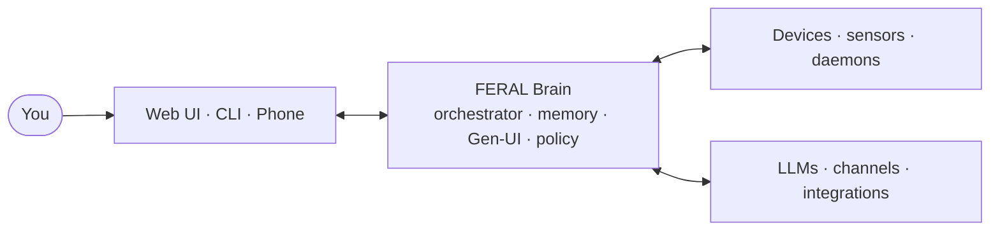

<p align="center">
  
</p>

<h3 align="center">One local brain for your apps, devices, and memory.</h3>
<p align="center"><em>FERAL runs on your machine. It connects software and hardware, keeps long-lived memory, learns your baseline, and executes with explicit control.</em></p>

<p align="center">
  <strong>Public beta — macOS &amp; Linux.</strong>
  <a href="CONTRIBUTING.md">Contribute</a> ·
  <a href="https://github.com/FERAL-AI/FERAL-AI/issues">File an issue</a> ·
  <a href="https://x.com/FeralAi67724">@FeralAi67724</a>
</p>

<p align="center">
  <a href="#quick-start">Quick Start</a> &nbsp;·&nbsp;
  <a href="#pair-your-phone">Pairing</a> &nbsp;·&nbsp;
  <a href="#what-works-today">What Works</a> &nbsp;·&nbsp;
  <a href="#architecture">Architecture</a> &nbsp;·&nbsp;
  <a href="#develop-from-source">Develop</a> &nbsp;·&nbsp;
  <a href="#contribute">Contribute</a>
</p>

<p align="center">
  <!-- sync-versions:badge -->
  
  <!-- /sync-versions:badge -->
  <a href="https://github.com/FERAL-AI/FERAL-AI/stargazers"></a>
  <a href="https://github.com/FERAL-AI/FERAL-AI/commits/main"></a>
  
  
</p>

---

## What FERAL Is

FERAL is a local-first runtime that sits between your software and your physical devices. You run it on your own machine and reach it from a browser, a phone, the CLI, or your own integrations.

What's inside:

- **4-layer memory** — working context, episodic events, semantic / graph retrieval, and execution history.
- **Baseline learning** — rolling metrics and anomaly / trend detection for what "normal" looks like for you.
- **Policy-gated execution** — approvals, time windows, and daily caps gate every action that touches the outside world.
- **Server-driven UI (Gen-UI)** — the brain emits structured UI payloads; clients render them. Third-party apps ship contracts, not freeform frontends.
- **Reviewed extension registry** — community skills and apps go through reviewer approval before they're installable.

It ships as `feral-core` (the brain runtime), `feral-client-v2` (web control surface), and `feral-nodes` (device and hardware bridges).

### About that memory

Every agent claims persistent memory, so the phrase says nothing on its own. For most, it means a profile file capped at a few thousand characters plus keyword search over old transcripts: miss the exact word and you miss the memory, nothing is ever forgotten so trivia competes with what matters, and none of it leaves the machine it was written on.

FERAL's is a store, not a note:

- **Four tiers, one retriever.** Working context, episodes, semantic/graph knowledge, and execution history are queried through a single ranked view that reports which tier each result came from, instead of each caller inventing its own lookup.
- **Hybrid retrieval.** SQLite FTS5 for lexical recall, 384-dim vector embeddings for meaning, and an entity-linked knowledge graph with confidence, evidence, and multi-hop traversal over a recursive CTE.
- **It forgets on purpose.** Decay is an Ebbinghaus curve with a SuperMemo SM-2 derivation, so rehearsed facts stay sharp and one-off detail fades. A store that never forgets gets slower and less useful at the same time.
- **It follows you across your own machines.** CRDT replication over mDNS peer discovery with hybrid logical clocks, no cloud relay, exercised by a nightly chaos suite.
- **Encryption at rest** is available as an AEAD envelope over `~/.feral/memory.db`, applied while the brain is stopped (the plaintext database is required at runtime).

Full detail in [the memory guide](https://docs.feral.sh/guides/memory).

## Quick Start

> **Requires Python 3.11+ with SQLite FTS5** on macOS 13+ or modern Linux (Ubuntu 22.04+, Fedora 40+, Arch). Windows is not supported as a host yet, use WSL2.
>
> Almost every interpreter has FTS5, but not all: python-build-standalone 3.11.13, for example, ships SQLite 3.49.1 without it. FERAL's memory store creates FTS5 tables at boot, so it refuses to start on such an interpreter with a message naming it. Run `feral doctor` if you are unsure: it reports FTS5 and loadable-extension support as two separate rows.

### Recommended: one-line install

```bash
curl -sSL https://raw.githubusercontent.com/FERAL-AI/FERAL-AI/main/scripts/install.sh | bash
```

This creates a virtualenv at `~/.feral-env`, installs `feral-ai` with all extras, runs the first-run setup wizard, and starts the brain. When it's done, open <http://localhost:9090>.

### Alternative: install from PyPI

```bash
pip install "feral-ai[all]"
feral setup
feral start
```

### Or install with your coding agent

If you have Claude Code, Cursor, Codex or similar and would rather not
use a terminal directly, **[AGENT_INSTALL.md](AGENT_INSTALL.md)** has a
prompt to paste into your agent. It installs FERAL, walks you through
setup, and then verifies the result rather than assuming it worked:
it checks the interpreter for FTS5 before installing (the usual reason
an install looks fine and the brain then will not start), and reads
`feral doctor` back to you at the end.

### Upgrading

```bash
feral update
```

That is the recommended path. It upgrades the Python environment that
is actually running the brain (`sys.executable`, not whatever `pip`
your PATH resolves first), prints which environment that is before
touching it, and restarts the brain afterwards so the new code is the
code that serves. It refuses rather than half-works: a source checkout
is sent to `git pull` instead of pip, and a brain running under a
different interpreter than the CLI is reported rather than skipped.
`feral update --check` reports what it would do and changes nothing.

By hand, the same thing is two commands:

```bash
pip install --upgrade "feral-ai[all]"
feral restart
```

**The restart is not optional.** A running brain holds its code in
memory from the moment it started and never reloads it, so upgrading
the package on disk does not change a process that is already serving.
The install succeeds, nothing errors, and the old build keeps answering
as if nothing happened. This is easy to miss for days.

`feral doctor` has a **Running version** row that compares the version
this process is executing against the version installed on disk, and
warns when they differ. `GET /api/dashboard` carries the same answer
under `runtime`. Neither contacts the network; both compare what is
already on the machine.

If you installed with the one-line installer, the brain lives in
`~/.feral-env`, so upgrade with that environment's pip:

```bash
~/.feral-env/bin/pip install --upgrade "feral-ai[all]"
feral restart
```

Check which install you are actually upgrading with `which feral`. More
than one Python environment on a machine can each hold their own copy,
and upgrading the one that is not running is the common mistake.
`feral update` exists because of that mistake: one operator ran the
upgrade against the wrong environment and served stale code for two
days believing they were current.

#### Checking for new releases (off by default)

FERAL does not contact PyPI unless you ask it to. Nothing in the boot
path, and nothing on any request path, opens a connection to check for
releases; the version rows described above compare two things that are
already on your machine.

`feral update` asks the index when you run it, because running it is
the request. If you also want the brain to notice new releases on its
own, turn the check on:

```bash
export FERAL_UPDATE_CHECK=1          # or "updates": {"check_pypi": true} in ~/.feral/settings.json
```

With it on, the brain asks pypi.org once a day on a background task
(never on a request), caches the answer under `~/.feral/update-check.json`,
and reports it as an **Update check** row in `feral doctor` and as
`update` on `GET /api/dashboard`. `updates.ttl_hours` (or
`FERAL_UPDATE_CHECK_TTL_HOURS`) changes the interval, and
`FERAL_PYPI_JSON_URL` points the check at an internal mirror. If the
network is unavailable the answer is `unknown`; it is never an error
and never blocks anything.

The brain will not upgrade itself. An upgrade replaces the code of the
process that would have to perform the restart, so it stays an operator
command.

### What `feral setup` walks you through

`feral setup` is an arrow-key wizard (↑/↓ to navigate, enter to pick the highlighted row):

1. **LLM provider** — OpenAI, Anthropic, Gemini, Groq, DeepSeek, OpenRouter, Ollama, LM Studio — with masked API key paste, and the key probed before you move on.
2. **Model** — type to filter through hundreds of model ids, then a one-token round-trip confirms the id actually works.
3. **Speech in / out** — realtime or chained, cloud or fully local.
4. **Identity + personality** — who you are, and how the agent should talk to you.
5. **Capabilities** — vision, proactive nudges, streaming, multi-agent, autonomy tier, and which folders the file tools may touch.
6. **Network access** — `localhost` (default), `LAN` so phones on the same Wi-Fi can pair, or `Tailscale Funnel` for free public DNS pairing from anywhere.
7. **Optional** — Google / Notion / Spotify / Microsoft 365 / Gmail, Home Assistant, search + weather keys, messaging channels.

Catalog providers without a runtime adapter in this build (Bedrock, Together, Fireworks) are not offered; point `llm.base_url` at an OpenAI-compatible gateway to use them.

You get a local brain on port `9090`, the bundled web UI, and a local config under `~/.feral/` (settings + an encrypted vault for keys).

### Use an existing ChatGPT sign-in through Codex

FERAL can use the Codex CLI's managed ChatGPT login without extracting OAuth
tokens or treating them as an OpenAI API key:

```bash
npm install -g @openai/codex
codex login
feral setup                    # choose "Codex (ChatGPT sign-in)"
```

The adapter talks to `codex app-server --stdio`, discovers the models available
to the signed-in account, and supports normal and streaming text turns. The
app-server interface is experimental, and FERAL tool schemas are not yet bridged
to Codex dynamic tools. Codex starts in `read-only` mode by default; set
`FERAL_CODEX_SANDBOX=workspace-write` only when that is the intended execution
boundary.

`danger-full-access` additionally requires `FERAL_CODEX_ALLOW_DANGEROUS_SANDBOX=1`.
Codex runs with `approvalPolicy: "never"`, so that mode lets it execute commands
that never pass FERAL's dangerous-tool gate. Two settings rather than one, so a
copied `.env` cannot hand out unrestricted execution on its own. Any value that
is unset, misspelled, or not opted in falls back to `read-only` with an error in
the log; it never stops the brain from starting.

`FERAL_CODEX_PATH`, `FERAL_CODEX_CWD`, and
`FERAL_CODEX_TIMEOUT_SECONDS` override the executable, working directory, and
turn timeout.

### Useful CLI commands

```bash
feral serve            # headless brain only (no chat / no client)
feral status           # runtime status
feral doctor           # diagnostics — what's reachable, what needs setup
feral access status    # current pairing / network mode
feral key add          # add or rotate a credential without re-running setup
feral memory status    # backend, knowledge graph counts, decay schedule
feral sync status      # federated peers + per-peer lag + last-sync clock
```

## Pair Your Phone

FERAL exposes three pairing modes:

| Mode | UI label | Best for | Requirement |
|---|---|---|---|
| `localhost` | This Mac only | No phone pairing yet | None |
| `local` | Same WiFi | Phone and brain on the same network | Brain reachable on LAN |
| `remote` | Anywhere | Pair from outside your LAN | Tailscale installed, Funnel enabled |

### Same WiFi

1. In setup, choose **Same WiFi**.
2. Open `Devices` → `Pair new device` → `Web phone`.
3. Click **Generate one-time link** and scan the QR from your phone.
4. If PIN is enabled, enter the 4-digit PIN shown on the Mac.

If the LAN URL is unreachable from your phone, restart the brain on all interfaces:

```bash
FERAL_HOST=0.0.0.0 feral start
```

### Anywhere (Tailscale)

Setup attempts this automatically when you choose **Anywhere**. You can also manage it later in `Settings` → `Access`.

1. In setup, choose **Anywhere**.
2. If setup reports a tunnel error, run:
   ```bash
   feral access remote-up
   ```
3. Complete any Tailscale prompts (`tailscale up`, Funnel enable URL).
4. Generate a new pairing link from `Devices` and scan it from anywhere.

Check status any time: `feral access status`. Disable with `feral access remote-down`.

### This Mac only

Use this if you just want the local dashboard and chat, no phone yet.

## What Works Today

FERAL is in **public beta**. Single-user local deployment is the primary target — multi-user / HA is not in scope yet. Here's what an operator can rely on, in plain language:

- **Chat, memory, and orchestration** — the core agent loop, the 4-layer memory store, and federated sync between brains are stable for day-to-day use.
- **Setup and CLI control** — the wizard, `feral start`, `feral doctor`, `feral memory`, `feral sync`, and `feral access` reflect real runtime state, not aspirational claims.
- **Web UI v2 core flows** — chat, devices, pairing, settings, and the SDUI inspector are stable.
- **Pairing lifecycle** — token issue, claim, expiry, and prune are stable.
- **Voice, channels, integrations** — usable, but their availability depends on the provider and runtime you've configured (some need keys, some need a local model, some need OAuth).
- **Gen-UI app platform** — the core renderer is stable; the third-party contract surface is still evolving.

For longer-tail integrations: try them, run `feral doctor`, and verify before depending on one in production.

Detailed history of every shipped change is in [`CHANGELOG.md`](CHANGELOG.md).

## Gen-UI in One Paragraph

Gen-UI in FERAL is **server-driven UI** (SDUI), not freeform frontend generation. The brain emits structured UI payloads; the client renders known component types. Payload updates stream as `sdui_patch` deltas. Third-party app surfaces run in a sandboxed model with explicit contracts. The `/canvas` view is a live inspector for SDUI frames. What it is *not* yet: native iOS / Android SDUI renderer parity, or a signed-marketplace trust model end to end.

## Architecture



- **Brain (`feral-core`)** — Python runtime: orchestrator, 4-layer memory, Gen-UI generator, pairing and policy, channel adapters, LLM router.
- **Clients (`feral-client-v2`, CLI, phone bridges)** — render the brain's SDUI surfaces and stream input back.
- **Nodes (`feral-nodes`)** — hardware daemons over a JSON WebSocket protocol (BLE / MQTT / serial / ROS bridges register their capabilities at connect time).
- **External** — LLM providers, messaging channels, OAuth integrations. All policy-gated.

Deeper reading: [`docs/ARCHITECTURE.md`](docs/ARCHITECTURE.md) and [`docs/orchestration.md`](docs/orchestration.md).

## Develop From Source

```bash
git clone https://github.com/FERAL-AI/FERAL-AI.git
cd FERAL-AI
make dev

# brain (headless)
.venv/bin/feral serve      # or: make serve

# web client v2 (optional live dev)
cd feral-client-v2
npm run dev
```

`make dev` is the only command you need. It builds `.venv/` from the CPython version in `.python-pin` (3.11.15, fetched from python-build-standalone), installs `feral-core[all,dev]` against `feral-core/requirements.lock` (the same extras and constraint CI uses), and ends by printing what it built:

```
  interpreter : /path/to/.venv/bin/python (Python 3.11.15)
  sqlite      : 3.53.1
  fts5        : OK
  loadable ext: OK
  Environment verified.
```

The pin exists because FERAL needs SQLite FTS5 (required: the memory store creates FTS5 tables at boot) and benefits from loadable SQLite extensions (optional: it gates `sqlite-vec`), and common interpreters ship one without the other. If `fts5` is not `OK`, `make dev` fails rather than leaving you with an environment where the brain cannot start.

`make dev` needs `uv >= 0.12`; if your machine has an older one or none, it downloads a pinned copy into `.uv/` and leaves your system `uv` untouched. Other targets: `make dev-reset` rebuilds `.venv` from scratch, `make dev-verify` re-prints the report, `make clean-uv` removes the repo-local uv.

Use `.venv/bin/python` (or the `make` targets, which route there for you) rather than a bare `python3`. This repo deliberately has **no** `.python-version` file: pyenv reads that name, and a pin it cannot satisfy silently redirects every `python3`, `pip` and `ruff` you run inside the tree.

Run the tests locally:

```bash
cd feral-core && ../.venv/bin/python -m pytest tests/ --no-cov -q
cd ../feral-client-v2 && npm test
```

## Docs

- User docs: `docs/mintlify/` (published at <https://docs.feral.sh>)
- Architecture deep dive: [`docs/ARCHITECTURE.md`](docs/ARCHITECTURE.md), [`docs/orchestration.md`](docs/orchestration.md)
- Capability status: <https://docs.feral.sh/reference/capability-status>
- Roadmap: [`docs/ROADMAP.md`](docs/ROADMAP.md)
- Contribution guide: [`CONTRIBUTING.md`](CONTRIBUTING.md)
- Security policy: [`SECURITY.md`](SECURITY.md)
- Release history: [`CHANGELOG.md`](CHANGELOG.md)

## Contribute

FERAL is **public beta** and welcomes contributors at every layer:

- **Runtime / orchestrator** — agent loop, LLM routing, multi-agent dispatch, policy enforcement.
- **Memory / knowledge** — 4-tier memory store, ingest pipelines, knowledge graph.
- **Gen-UI / provider surfaces** — SDUI engine, third-party app contracts, client renderer.
- **Hardware / daemons** — Node WebSocket protocol, BLE / MQTT / serial / ROS bridges.
- **Voice / perception** — realtime voice proxy, wake word, vision pipeline.
- **Channels / providers** — Telegram, Slack, Discord, Matrix, Signal, Feishu, Zalo, plus LLM provider adapters.
- **Frontend / shell** — web UI, Tauri desktop wrapper, mobile bridges.
- **Packaging / release** — wheel build, version coherence, NixOS flake, Home Assistant add-on.

How to start:

1. Read [`CONTRIBUTING.md`](CONTRIBUTING.md) — it picks the lane that matches your interest and lists canonical entry files.
2. Browse [open issues](https://github.com/FERAL-AI/FERAL-AI/issues) or open a new one with `feral doctor` output and a repro.
3. Join the conversation on [GitHub Discussions](https://github.com/FERAL-AI/FERAL-AI/discussions).
4. Follow [@FeralAi67724](https://x.com/FeralAi67724) on X for release notes.

The website ([feral.sh](https://feral.sh), source: [FERAL-AI/Feral-web](https://github.com/FERAL-AI/Feral-web)) is also open and welcomes design, copy, and accessibility PRs.

## What FERAL Is Not

- Not a managed cloud service.
- Not a multi-tenant / high-availability platform today.
- Not a claim that every listed integration is equally mature in every environment.

## Maintainers

- **[Mahmoud Omar](https://github.com/mahmoudomarus)** — founder and primary maintainer.
- **[Alpay Kasal](https://github.com/alpaykasal)** — co-founder, commercial and partnerships.
- **[Noah Zerkin](https://github.com/bzerk)** - Co-founder, Hardware Lead and maintainer.

Contact: [info@feral.sh](mailto:info@feral.sh) · Website: [feral.sh](https://feral.sh) · GitHub: [FERAL-AI](https://github.com/FERAL-AI).

## License

Apache License 2.0 — see [`LICENSE`](LICENSE). Attribution requirements live in [`NOTICE`](NOTICE).

<!--
  Internal sync marker used by .github/workflows/version-coherence.yml to
  reconcile live pytest / vitest counts. Not for human eyes — please leave
  it in place and do not edit by hand.
-->
<!-- sync-versions:test-counts pytest=10467 vitest=1264 -->
<!-- /sync-versions:test-counts -->
