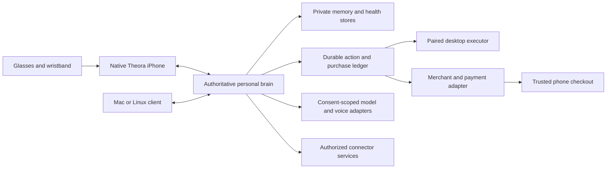

# Proposed architecture and cross-client contracts

September 30, 2026. Everything described as a contract or service below is proposed unless explicitly identified as existing. Implement both ends together; do not assume these fields or endpoints already exist. Existing HUP reports version 1.4.0. Negotiate additive features and version incompatible changes through the protocol process instead of silently changing that version.

## One agent, multiple surfaces



Start with one authoritative brain per person and local durable client queues/read caches. A phone, another computer or another model must not silently become a second authority for payments, approvals or schedules. Multiple active authorities require leases, fencing and tested failover; postpone that complexity until needed.

Self-hosted mode runs the brain on the user's computer/server; sleeping or disconnected hardware makes remote execution unavailable. Optional hosted mode runs an isolated personal brain, while a paired desktop executor provides local computer access when online. An always-on personal server is another deployment option. The UI explains which brain is selected and what can run now.

Current FERAL assumes a single operator. A hosted fleet needs real per-owner isolation of stores, processes, secrets, tool execution, quotas and telemetry. A shared singleton with a `user_id` field is insufficient. Start with isolated instances and benchmark unit cost; reconsider tenancy only with an explicit isolation design and adversarial tests.

## Identity and authority

Distinguish owner/account identity, brain cryptographic identity, agent personality, enrolled client device, hardware peripheral, execution node, connector identity and external peer. A chosen avatar or editable agent name grants no authority. A brain key proves key possession, not ownership of a Supabase account.

Enrollment binds a device public key and credentials to a verified owner/brain with narrowly scoped rights. Define account-backed and local-owner recovery separately. PIN pairing must be replay resistant and complete before access is granted. Add per-device revocation, credential rotation, recovery, active-session visibility and an explicit unlink operation. Store credentials using platform-protected facilities; do not migrate secret values into semantic memory.

All stores, queues and histories are owner-namespaced. Logout stops capture/upload, prevents new authorization/submission and safely cancels uncommitted work under the old owner before allowing another login. Externally submitted or unknown-outcome purchases still require restricted service-side reconciliation; logout/revocation cannot undo a merchant's committed effect. Retain versus erase is an explicit product choice; retained data remains inaccessible to the next owner. Account deletion tracks each destination and pending failures, with any legally required minimal transaction retention disclosed. Reinstallation and backups must not unexpectedly re-enroll a revoked device.

Same-owner private continuity is a new authenticated access/replication boundary. Existing FERAL `private` memory must stay excluded from external peer sharing. An external peer gets nothing by default and only explicitly shared scopes. Revocation blocks future disclosure; it cannot promise to recall another person's prior copies.

## Event envelope and transport

Proposed common fields for persisted events:

```json
{
  "schema_version": 1,
  "event_id": "stable UUID generated once",
  "owner_id": "validated from auth, never trusted from payload alone",
  "device_id": "enrolled source",
  "conversation_id": "optional stable thread",
  "turn_id": "optional correlated turn",
  "kind": "conversation.final",
  "occurred_at": "UTC source time",
  "ingested_at": "server-assigned UTC time",
  "source_refs": ["source observation or item IDs"],
  "revision": 1,
  "consent_scope": "conversation-memory",
  "sensitivity": "personal",
  "payload": {}
}
```

Stable IDs deduplicate retries. Source time and arrival time remain distinct; untrusted clock skew is recorded. Authenticated services derive owner and permissions independently. Keep raw audio out of the generic envelope; use controlled object references and separate retention policies.

Proposed operations are append batch, receive ACK, read since cursor, subscribe, correct/revise and delete. ACK means durable acceptance, not completed summarization or completed action. Batch replies identify accepted, duplicate and rejected IDs with recoverable reasons. Persist the local outbox before transmission and remove only durably acknowledged items. Make cursors opaque, bounded batches/backpressure explicit and ordering deterministic using conversation/turn relationships rather than device timestamps alone.

Handshake advertises protocol range and capabilities: text/stream outcomes, audio encodings/rates, approvals, sensor types, renderer types and supported contract versions. Unknown optional events are diagnosable; unknown mandatory requirements block the feature. Carry terminal outcomes for success, refusal, budget exceeded, canceled, expired, unavailable and failed. Every request gets an outcome or a bounded timeout; no infinite spinner.

Provide one canonical fixture corpus consumed by Python and Swift, then by desktop TypeScript. Include accepted/duplicate/rejected ACKs, delayed turns, refusal, fallback MP3 audio, different sample rates, changed quote, expired approval, unknown fields and version mismatch. Schema generation is optional; semantic fixtures are mandatory.

## Conversation and memory

Keep separate stores for conversational events, facts and preferences, tasks/actions, health observations and audit evidence. Link them with stable source IDs. Raw observations and user statements remain distinguishable from inferred summaries. A retrieved memory record should include content, provenance, asserted/inferred status, confidence, valid interval, revision, access policy, expiry and correction/deletion lineage.

Use explicit rules: a user correction wins over a prior inference; incompatible observed facts coexist with context rather than silently overwriting each other; append-only turns cannot be rewritten by model summary; high-impact facts need confirmation; uncertain or expired knowledge may be omitted or returned as uncertain. Consent controls what can be extracted and recalled. A summary is an index to evidence, not the only copy of history.

Learning initially means approved fact extraction, preference updates, retrieval improvements and measured skill reliability. It does not mean continuous weight training, cross-user pooling or autonomous personality changes. Any later research/training program needs separate opt-in, data lineage and deletion/retention treatment. Do not let learned trust turn spending into a generally reversible action.

Deletion affects originals, derived summaries, embeddings, caches and replicas; tombstones prevent replay resurrection. Backups have disclosed retention and restore filtering. Audit retains minimal authorized evidence without the deleted conversational content. Export includes sources, schemas and units so moving between supported hosting modes preserves meaning.

Evaluate retrieval across temporal questions, contradictions, revisions, multiple conversations and justified abstention. [LongMemEval](https://arxiv.org/abs/2410.10813) is a useful benchmark structure; add consented Theora examples and adversarial health/identity cases. Do not optimize a public score instead of the user's actual memory tasks.

## Health and hardware boundaries

Each observation carries source device/model/firmware, observation ID, measured/estimated/calibrated/inferred category, timestamp and duration, units, signal quality, worn state, calibration/model version and uncertainty where supported. Unsupported sensors produce unavailable state. Historical HealthKit readings must never masquerade as fresh glasses readings. Preserve original units plus explicit conversions; validate ranges without silently inventing replacement values.

Existing heuristic quality/confidence scores are not calibrated probabilities of medical accuracy. A score of 0.9 must not become “90% accurate.” Prompts, UI and exports must preserve score type and method; unavailable measurement uncertainty stays unavailable rather than being derived from a heuristic quality score.

Keep health ingestion transactional and resumable, with duplicate handling and per-item acceptance. Reproduce the backend batch rollback and multi-active-device concerns before changing them. Describe device-specific operations in capability manifests: Theora health-temple glasses, wristband and Theora Eye camera glasses have different contracts and exclusive-operation rules.

Health context is only used for a selected purpose with consent. For example, a user may request a day review using measurements and self-reported wellbeing; elevated heart rate alone must not establish stress, illness or causality. Do not feed sensitive health context to commercial targeting or a shopping merchant. Future raw optical/PTT processing needs a separately versioned signal and clinical-validation program.

HealthKit restrictions, intended medical claims, jurisdictional privacy and recording rules are launch requirements to verify with responsible experts. Connected health applications may fall under the FTC Health Breach Notification Rule even outside HIPAA-covered entities; unauthorized disclosure can be relevant. [FTC guidance](https://www.ftc.gov/business-guidance/resources/complying-ftcs-health-breach-notification-rule-0). This is a compliance workstream, not a finding that this particular app has already met a legal classification.

## Voice and model strategy

Use one audio owner on iPhone to arbitrate ambient capture, wake word, realtime conversation, chained fallback, approval speech and route changes. Separate ephemeral partial transcript from committed text; correlate audio/text/tool events with turn IDs. Barge-in cancels the matching playback/request; connection recovery must rebind a voice session before resuming outgoing audio.

The phone may handle local transcription or small supported tasks when eligible; local model availability is not equal to full desktop capability. Preflight downloadable assets and offer an honest missing-model state. Benchmark Apple adapters and an optional OSS adapter such as [Argmax OSS Swift](https://github.com/argmaxinc/argmax-oss-swift); evaluate licensing, language coverage, memory, battery, latency and privacy. No dependency installation or model selection is implied by this proposal.

Put tool credentials and execution policy in the brain/server, with one owner of tool execution even when client and server both receive realtime events. Use server controls appropriate to the selected API, rather than copying one API's configuration into another. [OpenAI voice server controls](https://developers.openai.com/api/docs/guides/voice-server-controls). Client playback needs explicit interruption handling; spoken output cannot simply be retracted after generation.

Build a provider-neutral capability interface and test at least the chosen default and fallback. Select models through task-specific evals for latency, groundedness, tool correctness, multilingual voice, price and data residency. Apply explicit input/output budgets, audio session limits, consent-scoped egress and cancellation. Secrets, card data and unnecessary health/raw audio never enter prompts. Offer local-only, cloud-assisted and hosted modes with clear feature availability rather than a misleading “on device” label for cloud voice.

## Action authority and integrations

The model proposes actions; deterministic policy and an authoritative ledger approve and execute them. Risk tiers should cover reading, reversible local writes, outbound communications, deletion, financial actions and sensitive data disclosure. Bind approvals to exact effects and expire them. A broad permission to use a browser is not an approval to submit a purchase or disclose a medical report.

Each action has stable ID, owner, requested effect, source turn, tool capability, target, immutable arguments/hash, policy version, approval requirements, expiry, executor lease, status and result evidence. Persist before side effects; use provider idempotency where supported. Cancellation before commit differs from an externally requested compensation after commit. Unknown outcome is an explicit state, never a success invented by the model.

Integration order: first-party device/notes/tasks; calendar and selected email drafts; optional user-confirmed messages; named shopping merchants; then broader ecosystem adapters. OAuth scopes are least privilege with visible disconnect/revoke. Keep webhook signatures/replay defense, account binding, API rate limits and schema changes in adapters. MCP is a transport/tool interface, not a blanket permission or quality guarantee. Imported documents, webpages and tool output are untrusted instructions.

Computer use is a fallback where APIs are absent: isolate the environment, limit destinations, bind consequential actions to user authorization and verify the result. [OpenAI computer-use guide](https://developers.openai.com/api/docs/guides/tools-computer-use). Evaluate pinned [OSWorld-V2](https://github.com/xlang-ai/OSWorld-V2) tasks alongside Theora's own supported workflows; do not equate benchmark performance with safe autonomous shopping.

Commerce uses the separate state machine in [core research](CORE_COMMERCE_RESEARCH.md). Enforce it across browser, shell, MCP, subagent and external-agent paths. If an executor cannot reliably enforce a financial boundary, it cannot receive credentials or unattended authority to complete purchases. A future spending mandate is merchant/category/amount/time constrained and distinct from confirmation of a particular order.

## Network and reliability

Use authenticated TLS for LAN and off-LAN connections; mDNS discovery is not trust. Preserve the relay's untrusted listener separation. Test certificate issue/renew/expiry, cellular/LAN switching, NAT, captive portal, reconnect storm, device revocation, process restart and laptop sleep. Avoid silently routing through a relay operator without explaining metadata/data flows.

Current LAN pairing can use HTTP/WebSocket endpoints; authenticated LAN TLS is proposed hardening, not existing universal support. Core and iOS must define bootstrap trust together: a validated enrollment channel binds the brain identity and certificate trust, self-hosted setup explains certificate installation or explicit authenticated pin enrollment, and endpoint rebinding/rotation proves continuity or requests fresh enrollment. Never accept an arbitrary discovered/self-signed certificate silently. Include mobile transport-security/local-network behavior, spoofed discovery, mismatched keys, renewal and lost-key recovery in acceptance fixtures and real-device tests.

Outages leave capture and drafts useful; actions show queued/unavailable, stale approvals cannot execute, payment unknowns reconcile. Apply bounded queues, storage quotas, adaptive retry and explicit last-sync/freshness indicators. Publish a supported connectivity matrix. Hosted service needs tenant isolation tests, encrypted backups with restore drills, incident response, availability objectives and per-owner resource limits before a public launch.
